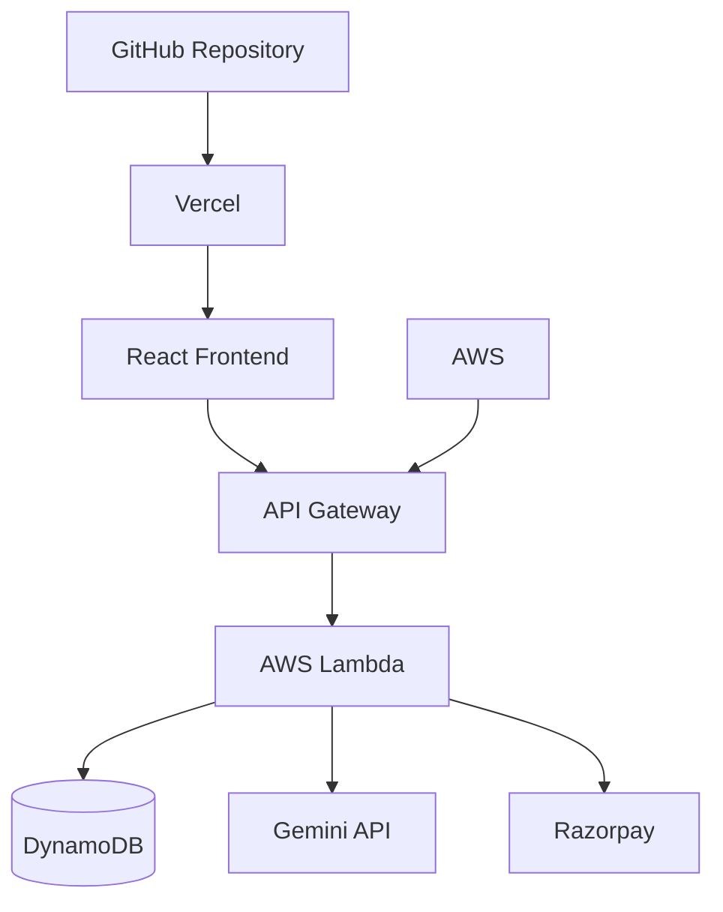

Perfect. ❤️ Now the **second file only**.

# 📐 `ARCHITECTURE.md`

Create this file in the **root of `retailpilot`**:

```text
ARCHITECTURE.md
```

Paste **only** the following:

````markdown
# RetailPilot — Architecture

## 1. System Overview

RetailPilot is a serverless AI retail operations and procurement agent designed around the lifecycle:

**Observe → Detect → Reason → Decide → Safety Check → Act → Track**

The system combines inventory, sales, vendor and expiry information with AI-generated reasoning and bounded commercial actions.

---

## 2. High-Level Architecture

```mermaid
flowchart TB

    OWNER[Store Owner]

    FRONTEND[React + TypeScript + Vite]

    API[Amazon API Gateway]

    ANALYSIS[Analysis Lambda]
    REVIEW[Review / Approval Lambda]
    PAYMENT[Payment Lambda]

    DB[(Amazon DynamoDB)]

    GEMINI[Gemini API]

    RAZORPAY[Razorpay Orders API + Checkout]

    OWNER --> FRONTEND
    FRONTEND --> API

    API --> ANALYSIS
    API --> REVIEW
    API --> PAYMENT

    ANALYSIS --> DB
    REVIEW --> DB
    PAYMENT --> DB

    ANALYSIS --> GEMINI

    PAYMENT --> RAZORPAY
````

---

## 3. Agent Lifecycle

```mermaid
flowchart LR

    OBSERVE[Observe<br/>Inventory + Sales + Vendors]
    DETECT[Detect<br/>Inventory Risk]
    REASON[Reason<br/>Gemini Explanation]
    DECIDE[Decide<br/>Recommended Action]
    SAFETY[Safety Check]
    APPROVAL{Approval<br/>Required?}
    ACT[Act<br/>Razorpay Checkout]
    TRACK[Track<br/>Action Events]

    OBSERVE --> DETECT
    DETECT --> REASON
    REASON --> DECIDE
    DECIDE --> SAFETY
    SAFETY --> APPROVAL

    APPROVAL -->|Auto-approved| ACT
    APPROVAL -->|Owner approval| ACT

    ACT --> TRACK
```

The approval route is determined by the configured procurement rules.

---

## 4. Frontend Layer

The frontend is built using:

* React
* TypeScript
* Vite
* CSS
* Recharts

The frontend provides interfaces for:

* Product management
* Product variants
* Sales recording
* Inventory analysis
* AI explanations
* Procurement recommendations
* Approval actions
* Razorpay Checkout
* Procurement result display

The frontend communicates with the backend through REST APIs exposed by Amazon API Gateway.

---

## 5. API Layer

Amazon API Gateway provides the HTTP interface between the frontend and backend Lambda functions.

Conceptually:

```text
React Frontend
      │
      ▼
API Gateway
      │
      ├── Product / onboarding operations
      ├── Sales operations
      ├── Inventory analysis
      ├── Procurement review
      └── Payment execution
```

This separates the user interface from the backend business logic.

---

## 6. Compute Layer

AWS Lambda provides the backend compute layer.

### `analyzeProduct.ts`

Responsible for analysing inventory conditions.

It considers:

* Current inventory
* Sales history
* Sales velocity
* Vendor lead time
* Reorder requirements
* Dead stock
* Expiry information

It also requests AI-generated explanations.

---

### `reviewProduct.ts`

Responsible for reviewing a procurement recommendation.

It:

1. Retrieves the relevant product
2. Retrieves its variants
3. Determines the procurement variant
4. Calculates the procurement amount
5. Determines the approval route
6. Creates an action for the next step

---

### `executePayment.ts`

Responsible for executing the approved procurement payment flow.

It:

1. Receives the procurement request
2. Runs safety checks
3. Creates the Razorpay order
4. Records the action event
5. Returns Razorpay Checkout information to the frontend

---

## 7. Data Layer

Amazon DynamoDB is used as the primary application database.

The system stores information for entities including:

```text
Products
Variants
Vendors
Sales
Expiry Batches
Agent Actions
```

The backend uses key-based queries to retrieve related records.

---

## 8. Inventory Intelligence

RetailPilot uses deterministic business logic to identify operational risks.

### Sales Velocity

Historical sales are used to estimate average daily sales.

```text
Average Daily Sales
        ↓
Expected Inventory Depletion
        ↓
Compare with Vendor Lead Time
        ↓
Determine Reorder Risk
```

---

### Reorder Detection

The system considers:

* Current stock
* Average daily sales
* Vendor lead time
* Safety buffer

If projected inventory depletion occurs too close to the expected replenishment period, the product is flagged for reorder.

A recommended procurement quantity is then calculated.

---

### Dead Stock

Products with insufficient sales activity can be identified as dead stock.

This helps identify inventory that may be tying up working capital.

---

### Expiry Risk

Expiry batches are checked against their expiry dates to identify products that may require attention.

---

## 9. AI Reasoning Layer

Gemini is used as the reasoning and explanation layer.

The deterministic inventory logic identifies the condition.

Gemini then converts the detected condition into a human-readable explanation.

Conceptually:

```text
Structured Inventory Signals
            │
            ▼
      Deterministic Rules
            │
            ▼
       Detected Risk
            │
            ▼
        Gemini API
            │
            ▼
    Human-readable Reason
```

This separation keeps the critical inventory calculations deterministic while using AI primarily for explanation and reasoning.

A deterministic fallback is available when the AI service cannot respond.

---

## 10. Approval & Safety Layer

RetailPilot uses bounded automation.

Before procurement is executed, the system evaluates safety conditions.

The approval decision considers:

```text
Autopay Enabled?
       │
       ├── No → Manual Approval
       │
       └── Yes
             │
             ▼
      Order Amount
             │
             ▼
    Autopay Threshold
             │
       ┌─────┴─────┐
       ▼           ▼
   Within Limit   Above Limit
       │           │
       ▼           ▼
   Auto Route   Manual Approval
```

This prevents the system from treating every recommendation as an unrestricted financial action.

---

## 11. Payment Layer

Razorpay is integrated into the procurement flow.

The current flow is:

```text
Owner Approval
      ↓
Backend Payment Endpoint
      ↓
Safety Checks
      ↓
Razorpay Order Creation
      ↓
Razorpay Checkout
      ↓
Test Payment
      ↓
Procurement Result
```

The application currently demonstrates Razorpay Checkout in test mode.

It does not claim to perform a production bank-to-bank vendor payout.

Production hardening would include server-side payment signature verification and webhook-based payment confirmation.

---

## 12. Action Tracking

RetailPilot records action events associated with procurement decisions.

Important events include:

```text
safety_checked
executed
blocked
```

These events provide the foundation for an audit-oriented operational history.

A production implementation could extend this into a complete immutable audit trail.

---

## 13. Deployment Architecture



The frontend is deployed through Vercel.

The backend infrastructure is deployed using AWS CDK.

---

## 14. Security Considerations

The prototype keeps sensitive credentials outside source control.

Environment variables are used for sensitive configuration such as:

* Razorpay credentials
* Gemini API credentials
* AWS configuration

The repository excludes `.env` files through `.gitignore`.

Production hardening should additionally include:

* Strong authentication
* Authorization checks
* Server-side payment verification
* Webhook verification
* Input validation
* Idempotency
* Stronger action authorization
* Production audit controls

---

## 15. Design Principles

### 1. Explainability

The merchant should understand why an action is recommended.

### 2. Bounded Automation

Automation should operate within explicit financial and business limits.

### 3. Human Control

High-risk or threshold-exceeding actions can require owner approval.

### 4. Deterministic Core Logic

Critical inventory calculations should not depend entirely on generative AI.

### 5. Action-Oriented Intelligence

The system should move beyond dashboards toward measurable operational actions.

---

## 16. Core Value Proposition

RetailPilot connects:

```text
Inventory Signal
       ↓
Commercial Decision
       ↓
Safety Boundary
       ↓
Owner Control
       ↓
Commercial Action
       ↓
Outcome Tracking
```

The goal is to transform inventory management from a reactive monitoring task into a controlled AI-assisted operational workflow.

````


